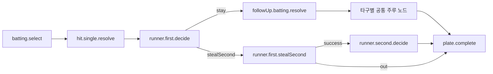

# 통합 시나리오 팩 규칙

타격과 주루는 별개의 이벤트 파일 모음이 아니라 하나의 `ScenarioPack` 그래프로 관리한다. 각 상황은 노드이고, 선택과 확률 결과는 다음 노드로 향하는 전이다.

## 기본 원칙

1. 공격 게임에는 하나의 루트 팩만 둔다.
   - 팩 ID는 `offense.core`처럼 게임 범위를 나타낸다.
   - 새 기능을 별도 실행 흐름으로 만들지 않고 기존 팩의 노드에 연결한다.
2. UI는 야구 규칙을 판단하지 않는다.
   - `App.tsx`에서 `event.kind === 'single'` 같은 분기를 추가하지 않는다.
   - UI는 현재 노드의 문구와 선택지를 렌더링하고 선택 ID만 실행기에 전달한다.
3. 모든 상태 변경은 `effects`로 선언한다.
   - 아웃, 득점, 안타, 주자 이동을 컴포넌트에서 직접 계산하지 않는다.
   - 동일한 효과는 어느 분기에서도 같은 의미를 가져야 한다.
4. 모든 이동은 명시적인 `transition.to`를 가진다.
   - 화면 전환을 암묵적인 이벤트 이름이나 배열 순서에 의존하지 않는다.
5. 확률은 `chance` 노드에서만 처리한다.
   - 선택 성공률과 돌발 이벤트 확률을 UI 코드에 넣지 않는다.
   - 확정형 모드도 같은 그래프를 사용하되 확률 노드를 건너뛰거나 결과를 지정한다.
6. 공통 흐름은 복사하지 않고 같은 노드를 재사용한다.
   - 예: 여러 타구가 `runner.first.decide`로 이어진다면 해당 노드를 한 번만 정의한다.
   - 문구만 다른 경우 플래그나 진입 효과를 사용하고 동일한 로직을 복제하지 않는다.
7. 모든 경로는 종료 노드에 도달해야 한다.
   - 타석 종료는 `terminal:plateComplete`, 경기 종료는 `terminal:gameComplete`를 사용한다.
   - 의도적인 반복은 아웃 증가나 타석 증가처럼 종료 조건을 변경하는 효과가 있어야 한다.

## 노드 종류

- `batting`: 타격 결과를 확정 선택하거나 가중치로 추첨한다.
- `choice`: 플레이어에게 선택지를 제공한다.
- `chance`: 도루 성공, 수비 실책 등 확률 결과를 결정한다.
- `event`: 상태 효과를 적용하고 즉시 다음 노드로 이동한다.
- `terminal`: 타석 또는 경기를 정산한다.

## ID 규칙

노드 ID는 `<영역>.<상황>.<행동 또는 결과>` 형태로 작성한다.

```text
batting.select
hit.single.resolve
runner.first.decide
runner.first.stealSecond
runner.first.stealSecond.success
runner.first.stealSecond.out
plate.complete
```

- 화면 문구가 바뀌어도 ID는 바꾸지 않는다.
- `node1`, `next`, `caseA`처럼 의미 없는 ID를 사용하지 않는다.
- 선택지 ID는 노드 안에서 유일한 동사형 이름을 사용한다: `stay`, `stealSecond`, `advanceHome`.

## 상태 효과 규칙

- 한 노드는 한 가지 판단 또는 사건만 표현한다.
- 주자 이동은 `moveRunner`로 기록하며 출발 베이스와 도착지를 모두 명시한다.
- 안타와 실책은 구분한다. 실책 진루에는 `addHits`를 적용하지 않는다.
- 3아웃 이후의 주자 이동과 득점은 실행기가 무시한다.
- 동일 베이스에 두 주자가 놓이는 전이는 유효하지 않다.
- 화면용 문구는 `record` 효과로 경기 기록에 남기고, 상태 계산 근거로 사용하지 않는다.

## 새 분기 추가 절차

1. 기존 팩에서 진입 조건과 합류 가능한 공통 노드를 찾는다.
2. 기존 노드로 표현할 수 없는 판단만 새 노드로 추가한다.
3. 새 노드의 모든 전이에 목적지와 상태 효과를 선언한다.
4. 종료 또는 기존 공통 노드로 다시 합류시킨다.
5. `validateScenarioPack`으로 누락 참조, 도달 불가 노드, 잘못된 가중치를 검사한다.
6. 최소 한 개의 성공 경로, 실패 경로, 3아웃 경로를 테스트한다.

## 예시 흐름



## 금지 패턴

- React 컴포넌트에 야구 규칙용 `if`/`switch` 추가
- 분기마다 별도 확률 상수 선언
- 기존 노드를 복사해 이름만 바꾼 분기 생성
- 목적지가 없는 선택지 또는 종료되지 않는 순환
- 표시 문구를 비교해 게임 상태를 판정

타입 계약과 검증기는 `src/game/scenario.ts`, 타격 이벤트 원본 데이터는 `src/game/battingEvents.ts`에서 관리한다.